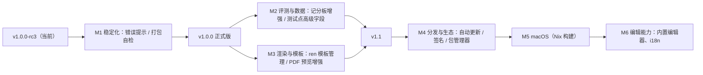
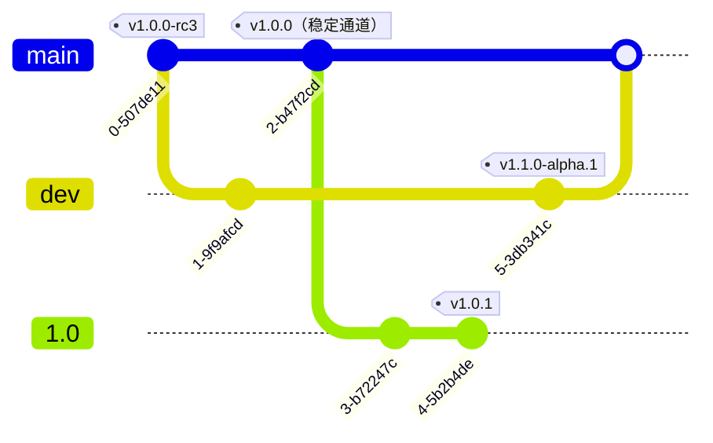

<!--markdownlint-disable MD001 MD033 MD041 MD051-->

<div align="center">

# Tuack-GUI

一款美观、跨平台的 [Tuack-NG](https://github.com/tuack-ng/tuack-ng) 图形化前端


[](https://github.com/Qaaxaap/tuack-gui)
[](https://github.com/Qaaxaap/tuack-gui/releases/latest)
[](https://github.com/Qaaxaap/tuack-gui/releases/)
[](https://github.com/Qaaxaap/tuack-gui/blob/main/LICENSE)
[](https://github.com/Qaaxaap/tuack-gui)

</div>

## 简介

[Tuack-NG](https://github.com/tuack-ng/tuack-ng) 是一套用于辅助 OI/ACM 竞赛题目开发的命令行套件，但因其是 CLI 工具，上手门槛较高。

Tuack-GUI 旨在解决这一问题：**为 Tuack-NG 提供一个美观、跨平台的图形化界面**，让使用者无需记忆和输入命令，即可完成题目工程的配置与各项操作，扩大用户群体、降低上手难度。

## 功能

### 核心目标

- [x] 图形化配置 `conf.json`（表单 + 高级 JSON 编辑器），无需手改配置文件
- [x] 按钮化执行 Tuack-NG 命令，无需手敲 CLI
- [x] 现代化的界面

### 配置编辑

- [x] 工程树展示（contest → day → problem 三层结构）
- [x] 常用字段图形化表单（名称 / 标题 / 类型 / 时限 / 空限 / 子目录 / Subtask / 样例等）
- [x] 高级原始 JSON 编辑与校验（修改任意字段）
- [x] 保存时保持字段顺序与格式，避免破坏手改内容

### 命令执行

- [x] 生成工程（`gen`：contest / day / problem / data / samples / code）
- [x] 测试题解（`test`，解析 `result.csv` 渲染评测记分板）
- [x] 渲染题面（`ren`）
- [x] 数据生成（`dmk`）
- [x] 数据校验（`validate`）
- [x] 批量修改配置（`conf`）
- [x] 导出评测系统（`dump`）
- [x] 文档检查 / 修复（`doc`）
- [x] 命令输出流式展示、可取消、进度显示

### 分发

- [x] 内置 Tuack-NG 二进制与资源，开箱即用
- [x] 支持切换外部 Tuack-NG 可执行文件路径
- [x] Windows / macOS / Linux 三平台安装包

## 开发路线

### 里程碑



### 分支策略

日常开发在 `dev` 分支进行，稳定版本切出维护分支并行修 bug：



### 里程碑说明

| 里程碑 | 内容 |
|---|---|
| M1 稳定化 | 报错信息再完善（反馈问题时能直接看到原因）、打包产物装后自检、正式版发布准备 |
| M2 评测与数据 | 记分板实时刷新与历史记录、`args` / `subtasks` / `checker` 依赖的可视化编辑 |
| M3 渲染与模板 | ren 模板管理（预览图 / 自定义模板目录）、PDF 预览缩放翻页 |
| M4 分发与生态 | 自动更新、代码签名、AUR / Nix / winget / Scoop |
| M5 macOS | 用 Nix 构建 Tuack-NG 与 Tuack-GUI，提供 macOS 包（Tuack-NG 尚无 macOS 预编译二进制） |
| M6 编辑能力 | statement.md / 生成脚本内置编辑器、工程模板预设、中英文切换 |

## 技术栈

- 桌面框架：[Tauri 2](https://tauri.app/)（Rust 后端 + 系统 WebView）
- 前端：[React](https://react.dev/) + [TypeScript](https://www.typescriptlang.org/) + [Tailwind CSS](https://tailwindcss.com/)
- 构建：[Vite](https://vitejs.dev/) + [pnpm](https://pnpm.io/)

## 架构

后端通过 `CommandRunner` 抽象屏蔽底层调用方式：

```
前端 ──(Tauri IPC, 异步 JSON)──▶ 后端
                                  ├─ CliRunner  （子进程调用 tuack-ng，当前方案）
                                  └─ RpcRunner  （JSON-RPC 客户端，待 Tuack-NG 提供接口后接入）
```

前端只通过语义化命令（如 `gen_contest` / `run_test` / `read_config`）与后端交互，待 Tuack-NG 暴露 JSON-RPC 接口后，会有计划迁移。

## 开始使用

> [!WARNING]
> 以下为开发环境搭建说明，仅使用请参考 `下载` 栏目

### 前置依赖

- [Node.js](https://nodejs.org/)（≥ 20）与 [pnpm](https://pnpm.io/)
- [Rust](https://www.rust-lang.org/)（stable 工具链）
- 系统 WebView：Windows 需 [WebView2](https://developer.microsoft.com/microsoft-edge/webview2/)，macOS 与 Linux 使用系统自带 WebView

### 开发

```bash
pnpm install
pnpm tauri dev
```

## 下载

通过 [GitHub Releases](https://github.com/Qaaxaap/tuack-gui/releases/) 下载所需平台版本。Nix 与 AUR 的支持在计划中。

## 致谢

感谢以下同学为本项目的开发提供支持（[✨](https://allcontributors.org/docs/zh-cn/emoji-key)）：

<!-- ALL-CONTRIBUTORS-LIST:START - Do not remove or modify this section -->
<!-- prettier-ignore-start -->
<!-- markdownlint-disable -->
<table>
  <tbody>
    <tr>
      <td align="center" valign="top" width="14.28%"><a href="https://github.com/deliya2011"><br /><sub><b>Vesperon</b></sub></a><br /><a href="#design-deliya2011" title="Design">🎨</a></td>
      <td align="center" valign="top" width="14.28%"><a href="https://github.com/Qaaxaap"><br /><sub><b>Qaaxaap</b></sub></a><br /><a href="#code-Qaaxaap" title="Code">💻</a> <a href="#ideas-Qaaxaap" title="Ideas, Planning, & Feedback">🤔</a> <a href="#doc-Qaaxaap" title="Documentation">📖</a> <a href="#design-Qaaxaap" title="Design">🎨</a> <a href="#maintenance-Qaaxaap" title="Maintenance">🚧</a></td>
      <td align="center" valign="top" width="14.28%"><a href="http://revitalize.top"><br /><sub><b>Weihao Cheng</b></sub></a><br /><a href="#design-Cwhirly" title="Design">🎨</a></td>
    </tr>
  </tbody>
</table>

<!-- markdownlint-restore -->
<!-- prettier-ignore-end -->

<!-- ALL-CONTRIBUTORS-LIST:END -->


- [Tuack-NG](https://github.com/tuack-ng/tuack-ng) —— 本项目的后端核心，感谢 [Pulsar](https://github.com/Pulsar33550336) 的辛勤维护。
- [Tuack](https://github.com/mulab11/tuack) —— Tuack-NG 的设计思想来源。

## 许可证

Copyright (C) 2025-2026 Tuack-GUI Develop Team.

本项目以 [Affero General Public License 3.0](https://www.gnu.org/licenses/agpl-3.0.html) 或更高版本获得许可，详见 [LICENSE](LICENSE)。
